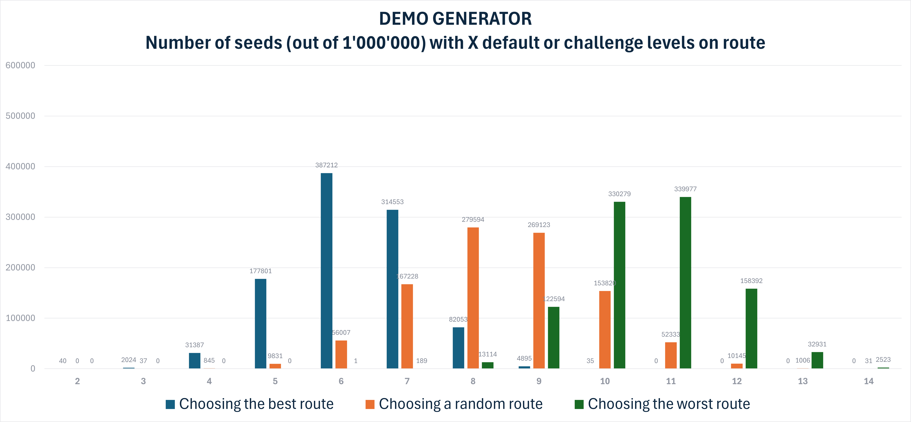
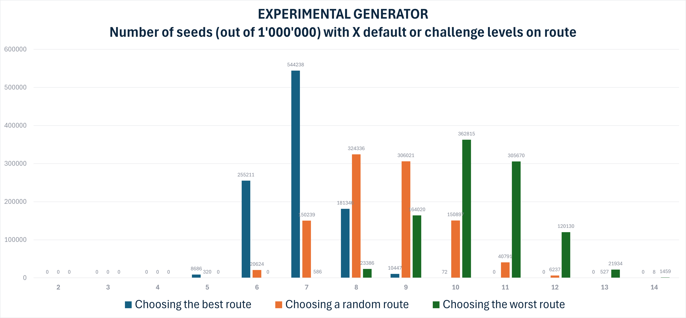

# Haste Layout Generator

This is a simple Visual Studio 2022 project which wraps the layout generation code from HASTE: Broken Worlds for easy analysis of different possible seeds.

Modifications to Landfall code are kept as minimal as possible, to make porting over new changes to the layout generation quick and easy.

You can view layouts using both the demo and experimental generator (explained below) at <https://haste.razzleware.de>.

## Analysis

Currently, there's two generators imlemented:

1. The Demo generator, which, as the name suggests, is used in the game demo to generate the shard layouts. This was the first generator released to the public, and it was quickly discovered that there's a lot of RNG with this generator, leading to a lot of dead-on-arrival runs.

2. The "experimental" generator was shared in the speedrunning discord and is not released anywhere yet. It was implemented to test if it is an improvement over the demo generator, which it is.

The experimental generator is almost identical as the demo generator, except with two additional rules which prevent the placement of skippable nodes:

1) Do not allow the same node type to show up twice in a row - no rest stop followed by a rest stop, etc..
2) Do not allow more than 2 "non-levels" in a row (shops, encounters, healing nodes). If you do get 2 non-levels in a row, the next node is guaranteed to be either a normal level or a challenge level.

This has a few consequences:

- With the experimental generator, the minimum number of default+challenge levels on the best route is increased to 5, up from 2 in the demo generator
- The "concentration" of the best routes is denser, because better routes automatically get kind-of downgraded.
- There is still a high difference between the average route when always choosing the best one (6.92 run-levels on average) to choosing a random route (8.56 on average). This means speedrunning the game requires skill to identify the optimal route in each shard.
- The mode of the best route is a 7 level seed, and the best practical value is 6, means that when doing a full game run, having an average seed is not actually that much worse than having the practically best seed - leading to less abandonded runs due to RNG

## Building

No special dependencies are needed to build this project. Though to really get any use out of it, you'll probably want to change the `main` method in `Program.cs` to do what interests you.