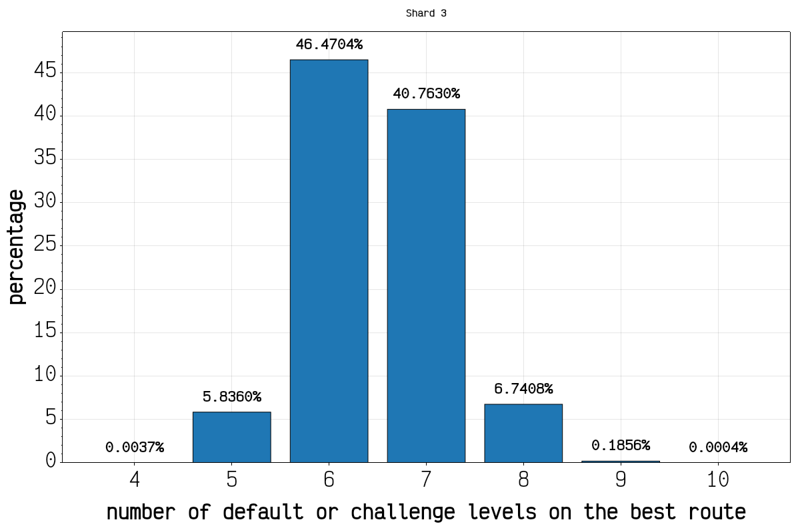
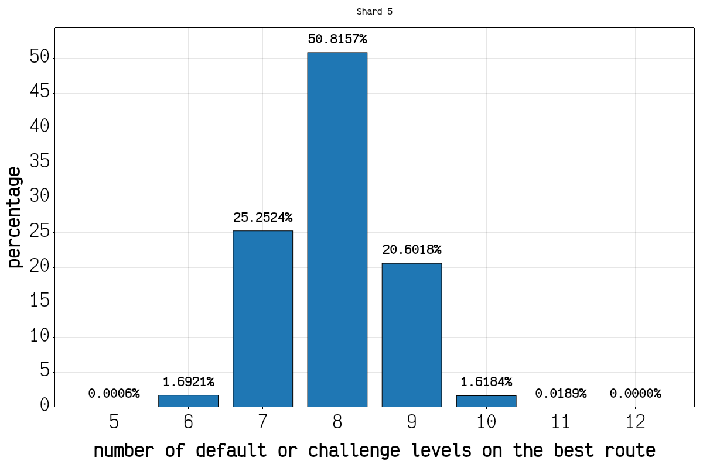
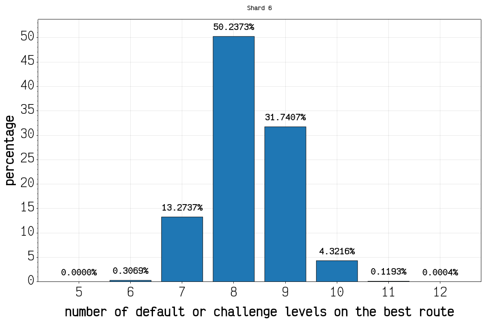
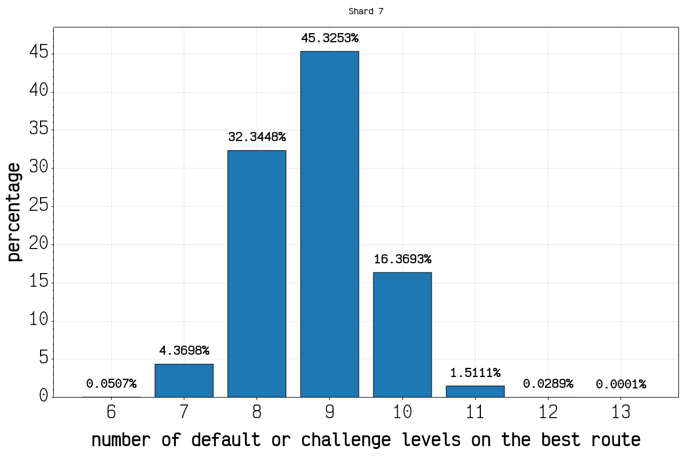
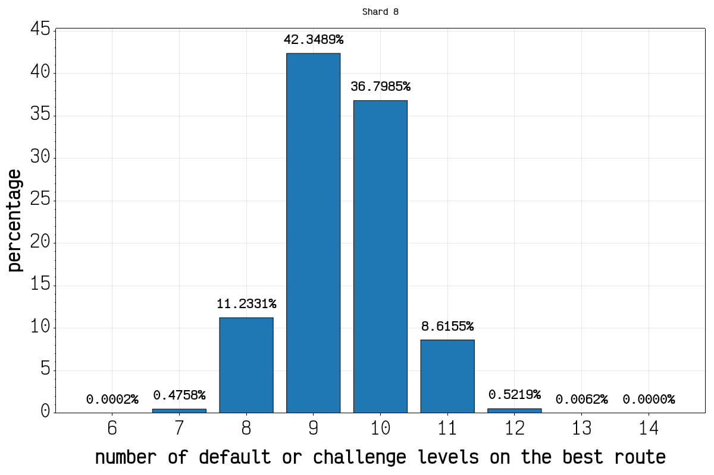
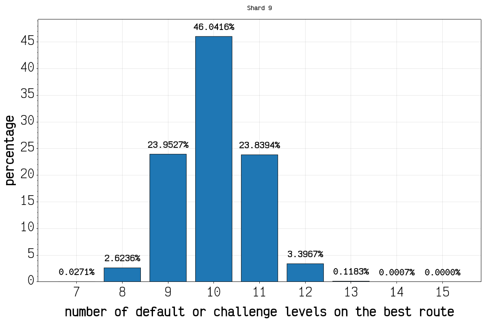

# Haste Layout Generator

This is a simple Visual Studio 2022 project which wraps the layout generation code from HASTE: Broken Worlds for easy analysis of different possible seeds.

Modifications to Landfall code are kept as minimal as possible, to make porting over new changes to the layout generation quick and easy.

You can view layouts using the latest generator at <https://haste.razzleware.de>. The Speedrunning Mod adds a QR code to the map screen, which can be used to recover the seed and shard. Simply paste a screenshot of the QR code on the website to reconstruct the map.

## Analysis

Note: The following plots apply to the latest released generator. For analysis of the demo and experimental generator, see [this commit](https://github.com/frereit/haste-world-gen/blob/84093923d5fad3641e5ec86307d1c916ada0c78b/README.md#analysis).

In this analysis, the first one million seeds of every shard were analysed and the best routes were counted. The first forced level of each shard counts towards the default levels in the route, and the shards are 0-indexed so the first shard is "shard 0".

## Building

No special dependencies are needed to build this project.

You can use the HasteLayoutGen project as a library to do generate the nodes and edges for any seed (with any generator), and then do any custom analysis you can dream of. It's easiest to just add a new Console Application to the project, with a dependency on the HasteLayoutGen project, or use the SeedAnalyser project as a base.

## Licenses

- This project bundles the "Noto Sans" font. Noto Sans is Copyright 2022 The Noto Project Authors (https://github.com/notofonts/latin-greek-cyrillic). You can view the full license text of the Open Font License [here](https://fonts.google.com/noto/specimen/Noto+Sans/license)